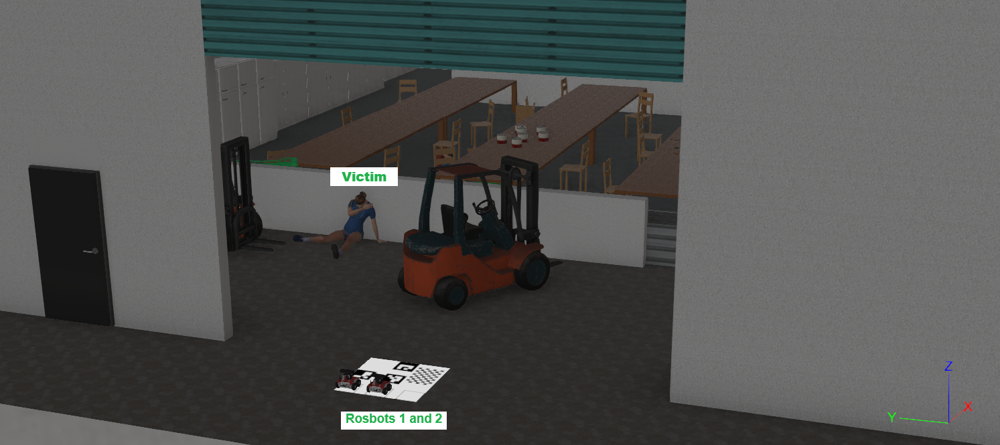
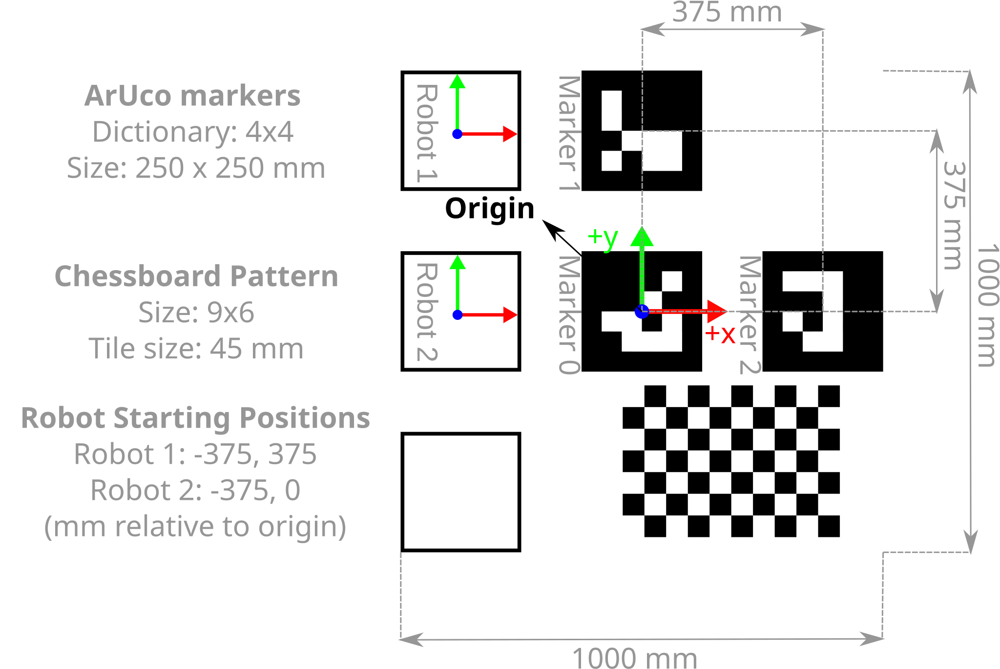
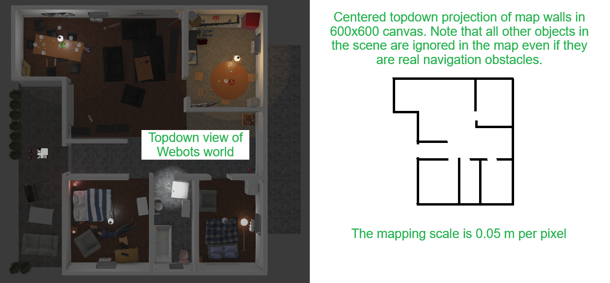

# IEEE SMCS Search and Rescue Competition 2026 Edition: Phase 1

This is the official repository for Phase 1 of the 2026 IEEE Systems, Man, and Cybernetics Society (SMCS) Search and Rescue (SAR) Competition. In Phase 1, teams will develop search and rescue strategies to coordinate a fleet of mobile robots searching for victims in simulation environments. The top scoring teams (up to six) will progress to Phase 2 of the competition, focusing on implementation in real robots. **Registration for Phase 1 is [now open](https://www.ieeesmc.org/2026-sar-competition/registration/).**

**Contents:**

- [Objectives of Phase 1](#objectives-of-phase-1)
- [Simulation Environment Installation](#simulation-environment-installation)
- [Controller Development Guide](#controller-development-guide)
  - [Flyover Footage](#flyover-footage)
  - [Origin Marker and Reference Coordinate Frame](#origin-marker-and-reference-coordinate-frame)
  - [Video Information Extraction](#video-information-extraction)
  - [Wheel Motors](#wheel-motors)
  - [Wheel Position Sensors](#wheel-position-sensors)
  - [RGB + Depth Camera](#rgb--depth-camera)
  - [Lidar Sensor](#lidar-sensor)
  - [IMU](#imu)
  - [Distance Sensors](#distance-sensors)
  - [Communication Devices](#communication-devices)
- [Marking Criteria](#marking-criteria)
- [Submission Guidelines](#submission-guidelines)
- [Constraints](#constraints)
- [Tips](#tips)
- [Example Report](#example-report)

# Objectives of Phase 1

Teams must design autonomous agents and algorithms to find victims in simulated search and rescue environments. The technical challenge involves two main components: extracting information from pre-recorded flyover footage of disaster scenes, and developing autonomy algorithms to find, navigate to and confirm victims. Flyover footage is provided for all development maps in this repository. The role of participants is to develop algorithms to extract useful information from this footage such as estimates of victim and obstacle locations and world maps. Information extracted from flyover footage can then be used to plan mission execution with a pair of autonomous ground vehicles. In this case, the role of participants is to develop the necessary algorithms to control the pair of ground vehicles such that they can navigate to identified victims (or find new ones) and report with confidence estimates when a victim is confirmed as found - by parking close to it (< 1.0m) and sending a notification message. Using the files, instructions and examples in this repository, you will be able to develop search and rescue strategies to satisfy these requirements. Then, at the end of Phase 1, you will [submit your solution](#submission-guidelines) for judging on unseen simulation scenarios.

# Simulation Environment Installation

The simulation environments to be used during Phase 1 are developed in Webots, an open-source multi-platform robot simulation environment. This repository contains three worlds on which participants should develop and test their solutions. A few useful examples are included to help you get started. Please follow these steps to set up the development environment:

1. Download and install [Webots R2025a](https://www.cyberbotics.com/#download).
2. Download and install [Python 3](https://www.python.org/downloads/). We require the use of versions 3.10 onwards. Note: it is possible to use other programming languages to write robot controllers for Webots, however, in this competition we require participants to use Python in order to facilitate marking.
3. Enable [Git Large File Storage](https://git-lfs.com/) and clone this repository.

```bash
git lfs install
git clone https://github.com/IEEE-SMCS/2026-ieee-smcs-competition-phase-1
```

4. Create a virtual python development environment. By default, Webots uses the system's Python installation.

```bash
# In windows...
cd <path to cloned repo>
python -m venv .venv
.venv/Scripts/activate
pip install numpy pillow # necessary packages for running our examples
```

5. Configure Webots to use the created `.venv`. Open Webots, then navigate to `Tools > Preferences > General` and modify the `Python command` field. For instance, in Windows, set it to `<path to cloned repo>/.venv/Scripts/python.exe`. You may now install any dependencies that you want to use in that virtual environment. To submit your solution, you will need to provide a reliable means to replicate this environment as outlined in the [submission section](#submission-guidelines).
6. (optional) Configure your IDE for development. For example, in VSCode ensure that your `.vscode/settings.json` file contains the lines below. This will enable all the auto-complete functionality for the Webots Python API.

```json
{
  "python.analysis.extraPaths": [
    "C:/Program Files/Webots/lib/controller/python" // Adjust path for your OS and Webots location
  ]
}
```

7. Test the installation. From the Webots UI, `File > Open World`, browse for `<path to cloned repo>/worlds/basic_example.wbt`, open it and run the simulation. Look at the console output. You should see print statements with sensor information from the robot in this simulation. There should be no errors.

# Controller Development Guide

For each simulation you will need to analyse pre-recorded footage of the disaster scene, use the extracted information to create a mission plan and execute the mission by controlling a pair of ROSbot. The ground robots start from fixed positions relative to an origin marker mat of known dimensions. The origin marker is also the take-off location for all flyover videos and contains useful patterns that should help you establish a frame of reference and estimate dimensions. Victims are represented by human figures as seen on the image below. To successfully score points for finding a victim, you must identify their location, **drive close to them (< 1.0m)** with any of the ground robots and send a message to notify that you have found a victim. Once a victim has been marked as found, no more points are awarded for finding the same victim again.



There are three practice worlds included here where you may test and develop your solution: `worlds/small_world.wbt`, `worlds/medium_world.wbt`, and `worlds/large_world.wbt`. The ROSbots in these simulations are configured to look for the controller in `controllers/proposed_solution/proposed_solution.py`, you should develop all your code in the `proposed_solution` folder and your main control loop should be in `proposed_solution.py`. It is crucial that you adhere to these instructions for the final automated marking to work correctly.

To get you started, the remainder of this section contains important information about the flyover footage and origin marker, as well as, a list of the sensors and actuators available on ROSbot along with links to documentation, source files, and Python examples on how to use the devices. A detailed example of how to access and use all of the sensors and actuators can be found in the file `rosbot_sensors_actuators_example.py` located in the `controllers/rosbot_sensors_actuators_example` folder.

- [ROSbot Docs](https://webots.cloud/run?version=R2025a&url=https%3A%2F%2Fgithub.com%2Fcyberbotics%2Fwebots%2Fblob%2Freleased%2Fprojects%2Frobots%2Fhusarion%2Frosbot%2Fprotos%2FRosbot.proto)
- The custom Rosbot definition used in simulations is located at `./protos/Rosbot.proto`

**IMPORTANT**: Make sure to read the [Communication Devices](#communication-devices) section to understand how to notify when a victim is found. Failure to send the correct message format will prevent you from scoring points.

### Flyover Footage

Flyover footage for each of the development maps in the repository can be found in `./recordings` in `.mp4` format alongside CSV files with IMU data for each flight. Footage is recorded at 30 FPS at a resolution of 1920x1080 px. You will need to enable Git LFS to clone the video files. For example, for `worlds/large_world.wbt`, the relevant flyover video and inertial data are `recordings/large_world_flyover.mp4` and `recordings/large_world_flyover.csv` respectively. IMU data was recorded using a simulated MPU-9250 sensor - more information about this sensor can be found in the [IMU section](#imu). In short, each flyover video consists of a vertical takeoff from the origin marker mat, followed by execution of a predefined route along which downward facing camera footage is recorded. After takeoff, flight altitude may vary when the UAV enters areas with lower ceiling clearance. The patterns and known dimensions of the origin marker mat should help you develop camera calibration routines and estimate distances as the UAV moves through the scene. Spatial dimension estimation is important because part of the [marking criteria](#marking-criteria) is based on how accurately you can estimate victim locations relative to the take-off point, and how accurately you can estimate the world layout (e.g. produce a map from the footage). The next section explains more about the origin marker.

### Origin Marker and Reference Coordinate Frame

The origin marker (shown in the image below) is a white mat of size (1x1 m) with the following patterns painted on it:

1. Three 4x4 ArUco markers of size 0.25 x 0.25 m that mark the position of the origin and the directions of the reference X and Y axes
   - The center of Marker 0 is the origin of the reference frame you should work on
   - The line connecting the centers of Markers 0 and 2 is the direction of the positive X axis of the reference frame
   - The line connecting the centers of Markers 0 and 1 is the direction of the positive Y axis of the reference frame
   - The Z axis is perpendicular to X and Y and completes a right-handed coordinate frame (i.e. positive direction is out of the screen in image below)
   - In the development worlds, the XY plane the ground plane and the Z coordinate is positive upwards
   - In all simulations robot 1 starts at position (-0.375, 0.375) m and robot 2 starts at position (-0.375, 0) m relative to the origin 
2. A 9x6 chessboard pattern with tile size 45 mm that can be used for intrinsic camera calibration (or any other use you might come up with!).

It is up to teams to develop suitable odometry strategies to keep track of their position relative to the origin - the ground robots and UAV used during simulations are not equipped with a global positioning sensor.



### Video Information Extraction

Your flyover footage analysis algorithms will be marked based on their ability to identify victims and estimate their position (in the reference frame introduced in the previous section), and based on their ability to generate an estimate of the map layout (accounting for walls only). To ensure your outputs are picked up by the automated marking pipeline, save your extracted information in the exact locations and formats specified below before running each simulation. The [report](#example-report) returned by the marking server contains a section called `INPUT VALIDATION WARNINGS` which provides details on incorrect inputs.

**Victim location estimates**

- Save file to: `controllers/proposed_solution/sim_logs/victim_location_estimates.csv`
- File type: CSV text file (no header row)
- Required content: one victim estimate per line, with at least two comma-separated numeric values

```text
x,y
x,y
...
```

- Interpretation:
  - `x` and `y` are 2D victim position estimates in meters, in the origin marker reference frame
  - Do not include non-numeric text - empty/malformed lines may cause the estimates to be rejected

**Map layout estimate**

- Save file to: `controllers/proposed_solution/sim_logs/map_estimate.png`
- File type: PNG image
- Required dimensions: `600 x 600` pixels
- Scale: 0.05 m per pixel
- Required colors (strict):
  - Black (`RGB = [0, 0, 0]`) for walls
  - White (`RGB = [255, 255, 255]`) for free space
  - No other colors or gray levels are accepted
- The ground-truth map is automatically generated by the supervisor and sent to the marking server once a simulation concludes
- **All walls are 0.2 m thick** - use this information to correctly draw exterior walls
- You should ignore all obstacles besides walls when generating the map and the result should be centered in the 600 x 600 canvas. See example below



### Wheel Motors

ROSbot has four motors. The motor names are `fl_wheel_joint` for the front left wheel, `fr_wheel_joint` for the front right wheel, `rl_wheel_joint` for the rear left wheel, and `rr_wheel_joint` for the rear right wheel.

- [Docs for RotationalMotor](https://www.cyberbotics.com/doc/reference/rotationalmotor?version=R2025a) and see also [Docs for Motor](https://www.cyberbotics.com/doc/reference/motor?version=R2025a)
- [Motor Python API](https://github.com/cyberbotics/webots/blob/released/lib/controller/python/controller/motor.py)

Example usage

```python
from controller import Robot
rosbot = Robot()
front_left_motor = rosbot.getDevice("fl_wheel_joint")
front_left_motor.setPosition(float("inf"))
front_left_motor.setVelocity(1.0)
```

### Wheel Position Sensors

Each wheel has a corresponding position sensor that can measure the wheel’s rotation. The sensor names are `front left wheel motor sensor`, `front right wheel motor sensor`, `rear left wheel motor sensor`, and `rear right wheel motor sensor`.

- [Docs for PositionSensor](https://www.cyberbotics.com/doc/reference/positionsensor?version=R2025a)
- [PositionSensor Python API](https://github.com/cyberbotics/webots/blob/released/lib/controller/python/controller/position_sensor.py)

Example usage

```python
from controller import Robot
rosbot = Robot()
fl_sensor = rosbot.getDevice("front left wheel motor sensor")
fl_sensor.enable(rosbot.getBasicTimeStep())
value = fl_sensor.getValue()
print("Front left wheel position:", value)
```

### RGB + Depth Camera

ROSbot has a forward-facing Astra camera which outputs RGB and depth images. This device comprises a Webots camera and range finder.

- [Docs for Orbbec Astra](https://webots.cloud/run?version=R2025a&url=https%3A%2F%2Fgithub.com%2Fcyberbotics%2Fwebots%2Fblob%2Freleased%2Fprojects%2Fdevices%2Forbbec%2Fprotos%2FAstra.proto)
- [Orbbec Astra proto file](https://github.com/cyberbotics/webots/blob/released/projects/devices/orbbec/protos/Astra.proto)
- [Docs for Camera](https://www.cyberbotics.com/doc/reference/camera?version=R2025a)
- [Camera Python API](https://github.com/cyberbotics/webots/blob/released/lib/controller/python/controller/camera.py)
- [Docs for RangeFinder](https://www.cyberbotics.com/doc/reference/rangefinder?version=R2025a)
- [RangeFinder Python API](https://github.com/cyberbotics/webots/blob/released/lib/controller/python/controller/range_finder.py)

Example usage

```python
from controller import Robot
rosbot = Robot()
rgb_camera = rosbot.getDevice("camera rgb")
rgb_camera.enable(rosbot.getBasicTimeStep())
image = rgb_camera.getImage()
print("Captured RGB image size:", rgb_camera.getWidth(), rgb_camera.getHeight())
print("Captured RGB image:", image)

depth_camera = rosbot.getDevice("camera depth")
depth_camera.enable(rosbot.getBasicTimeStep())
depth = depth_camera.getRangeImage()
print("Depth image: ", depth)
```

### Lidar Sensor

ROSbot is equipped with an RpLidarA2. This device comprises a Webots Lidar named `laser`.

- [Docs for RpLidarA2](https://webots.cloud/run?version=R2025a&url=https%3A%2F%2Fgithub.com%2Fcyberbotics%2Fwebots%2Fblob%2Freleased%2Fprojects%2Fdevices%2Fslamtec%2Fprotos%2FRpLidarA2.proto)
- [RpLidarA2 proto](https://github.com/cyberbotics/webots/blob/released/projects/devices/slamtec/protos/RpLidarA2.proto)
- [Docs for Lidar](https://www.cyberbotics.com/doc/reference/lidar?version=R2025a)
- [Lidar Python API](https://github.com/cyberbotics/webots/blob/released/lib/controller/python/controller/lidar.py)

Example usage

```python
from controller import Robot
rosbot = Robot()
lidar = rosbot.getDevice("laser")
lidar.enable(rosbot.getBasicTimeStep())
lidar.enablePointCloud()
ranges = lidar.getRangeImage()
print("Number of lidar points:", len(ranges))
print("Lidar image:", ranges)
```

### IMU

ROSbot is equipped with an MPU-9250 IMU. This sensor is implemented as a Webots accelerometer (`imu accelerometer`), gyroscope (`imu gyro`) and compass (`imu compass`).

- [Docs for MPU-9250](https://webots.cloud/run?version=R2025a&url=https%3A%2F%2Fgithub.com%2Fcyberbotics%2Fwebots%2Fblob%2Freleased%2Fprojects%2Fdevices%2Ftdk%2Fprotos%2FMpu-9250.proto)
- [MPU-9250 proto](https://github.com/cyberbotics/webots/blob/released/projects/devices/tdk/protos/Mpu-9250.proto)
- [Docs for Accelerometer](https://www.cyberbotics.com/doc/reference/accelerometer?version=R2025a)
- [Accelerometer Python API](https://github.com/cyberbotics/webots/blob/released/lib/controller/python/controller/accelerometer.py)
- [Docs for Gyro](https://www.cyberbotics.com/doc/reference/gyro?version=R2025a)
- [Gyro Python API](https://github.com/cyberbotics/webots/blob/released/lib/controller/python/controller/gyro.py)
- [Docs for Compass](https://www.cyberbotics.com/doc/reference/compass?version=R2025a)
- [Compass Python API](https://github.com/cyberbotics/webots/blob/released/lib/controller/python/controller/compass.py)

Example usage

```python
from controller import Robot
rosbot = Robot()
acc = rosbot.getDevice("imu accelerometer")
acc.enable(rosbot.getBasicTimeStep())
values = acc.getValues()
print("Acceleration:", values)

gyro = rosbot.getDevice("imu gyro")
gyro.enable(rosbot.getBasicTimeStep())
rates = gyro.getValues()
print("Angular velocity:", rates)

compass = rosbot.getDevice("imu compass")
compass.enable(rosbot.getBasicTimeStep())
heading = compass.getValues()
print("Compass vector:", heading)
```

### Distance Sensors

ROSbot has four short-range infrared sensors, two at the back and two at the front. These are named `fl_range` for front left, `fr_range` for front right, `rl_range` for rear left, and `rr_range` for rear right. The maximum detection range of the sensors is 2 m.

- [Docs for DistanceSensor](https://www.cyberbotics.com/doc/reference/distancesensor?version=R2025a)
- [DistanceSensor Python API](https://github.com/cyberbotics/webots/blob/released/lib/controller/python/controller/distance_sensor.py)

Example usage

```python
from controller import Robot
rosbot = Robot()
front_left_range = rosbot.getDevice("fl_range")
front_left_range.enable(rosbot.getBasicTimeStep())
value = front_left_range.getValue()
print("Front-left range:", value)
```

### Communication Devices

The custom ROSbots used in simulations use emitters and receivers for robot-to-robot communications and victim found notifications. The victim found communication device is named `supervisor emitter`, it communicates on channel `43` exclusively - no other channels are allowed. **Do not use this channel for any other communications in your solutions**. The robot-to-robot communication devices are named `robot to robot emitter` and `robot to robot receiver`. Both of these devices operate by default on channel `73` meaning that messages sent by emitters are broadcast to all robots, including the robot that sent the message. Changes of communication channel are allowed, for instance, to establish exclusive communication channels between robots instead of broadcasting.

- [Docs for Emitter](https://www.cyberbotics.com/doc/reference/emitter?version=R2025a)
- [Docs for Receiver](https://www.cyberbotics.com/doc/reference/receiver?version=R2025a)
- [Emitter Python API](https://github.com/cyberbotics/webots/blob/released/lib/controller/python/controller/emitter.py)
- [Receiver Python API](https://github.com/cyberbotics/webots/blob/released/lib/controller/python/controller/receiver.py)

The victim found notification message has a predefined structure as explained below. Warnings are printed to the Webots console when the message format is incorrect and errors that crash the message listener may occur. Automated marking may not work at all if your messages are not properly formatted, please make sure you get this part right.

```Python
{
  "timestamp": float, # Time the message was sent in simulation time e.g. rosbot.getTime()
  "robot_id": str, # ID of the robot sending the message
  "position": list, # Position at the time of sending the message (e.g. X, Y, Z coordinates relative to origin marker as estimated by your odometry solution)
  "victim_found": bool, # Should be True when the robot thinks it has found a victim
  "victim_confidence": float # A measure [0, 1] of how confident the robot is about having found a victim. 0 is no confidence at all, 1 is complete confidence.
}
```

**IMPORTANT**: You should only send this message when you are quite confident that you found a victim, the marking scheme rewards reporting with high confidence.

For robot-to-robot communications you are free to define message formats.

Example usage

```python
from controller import Robot
import json

rosbot = Robot()

# Supervisor comms device
supervisor_emitter = rosbot.getDevice("supervisor emitter")

# Squad comms devices
squad_receiver = rosbot.getDevice("robot to robot receiver")
squad_receiver.enable(rosbot.getBasicTimeStep())
squad_emitter = rosbot.getDevice("robot to robot emitter")

# Send a victim found message
message_dict = {
  "timestamp": rosbot.getTime(),
  "robot_id": rosbot.getName(),
  "position": [1.21, -4.89, 0.0]
  "victim_found": True,
  "victim_confidence": 1.0,
}
supervisor_emitter.send(json.dumps(message_dict).encode())

# Send a squad message
squad_emitter.send("Hello squad".encode())

# Receive a squad message
if squad_receiver.getQueueLength() > 0:
  message = squad_receiver.getData()
  print("Received message:", message)
  squad_receiver.nextPacket()
```

# Marking Criteria

During development you will be marked using an automated script hosted on a remote server. Marking is automatically triggered when a simulation ends which happens when all victims in the world are found or when a 3-minute time limit is reached. During the simulation, a Webots supervisor controller logs the actions taken by robots as well as the communications between robots and the supervisor, this log is sent to the remote server for marking. The marking criteria is as follows:

1. **Victim Finding (40%)**: This score combines three factors: (a) the ratio of victims found, (b) a time factor based on how quickly victims were found, and (c) a confidence accuracy term computed from your victim-found reports and confidence values. **Remember:** to successfully score a victim, the reporting robot must be within 1.0 m of that victim - the simulated human victims can be large, the distance between the robot and victim is computed relative to the approximate centroid of the victim (e.g. waist area/middle of the body) projected to the ground plane. 
2. **Efficiency (15%)**: This score combines distance travelled and mission duration. Higher scores are awarded when victims are found with less distance travelled per victim and shorter mission durations.
3. **Coordination (15%)**: This score measures efficient distribution of labour between the pair of ground robots. Higher marks are awarded when robots find an even number of victims.
4. **Video Information Extraction (30%)**: This score is the average of victim location estimate accuracy (how well submitted victim coordinates match ground truth positions, including estimate-count consistency), and map estimate accuracy (agreement between your submitted wall map and the generated ground-truth wall map). Always check the `INPUT VALIDATION WARNINGS` section of the [marking report](#example-report) for information on how to improve this score.    

Once the development phase finishes, you will need to submit your code and solution as explained in the next section. The top teams of Phase 1 will be selected through a combination of automated evaluation on unseen disaster worlds and marks awarded by a panel of human judges. You will also need to prepare an online presentation to explain your proposed solutions for flyover video information extraction, mission planning and ground robot fleet control and coordination.

# Submission Guidelines

The final submission should be in the form of a repository with clear instructions on how to replicate your python environment and all the necessary files to execute your controller and flyover information extraction algorithms. The contents of your repository will be cloned into `controllers/proposed_solution`, where we will also install your virtual python environment. Your submitted repository should include:

- `readme.md`: a file with a concise explanation of your solution and instructions for replicating your python environment
- `requirements.txt` if using `venv` and `pip` so that we can replicate your environment by running the lines below. Make sure to specify which python version you are using and do not use versions older than `3.10`

```bash
python -m venv .venv
.venv/Scripts/activate
pip install -r requirements.txt
```

- `environment.yml` If you are using conda to create the virtual environment so that we may replicate your environment by running `conda env create -f environment.yml`
- `proposed_solution.py` the file where your ground robot control algorithm is defined. This is the file that will be picked up by Webots during simulations
- A one line command to trigger flyover video processing before a simulation. e.g. `python prepare_mission_plan.py --file recordings/large_world_flyover.mp4`. **Or even better, include this pre-processing step in `proposed_solution.py` before the main control loop starts**
- Any additional files, custom python modules or static assets that `proposed_solution.py` depends on. Remember: no compiled objects or extraneous files!

When you are ready to submit, email a link or invitation to your submission repository to `cgonzalezarango "AT" swin "DOT" edu "DOT" au`. Your subject line **MUST** be `2026 IEEE SMCS SAR Competition Submission`. You may continue to update the repository until Phase 1 ends. Copies of the repositories will be automatically gathered at the end of Phase 1 - updates to the repository done after the Phase 1 end date will not be considered.

# Constraints

Beware of the following constraints:

- All your algorithms need to be developed in Python. In the final submission we expect Python files only and trivial static assets if you need them (e.g. png, jpg, txt, csv files etc). **No `.exe`s or compiled objects of any form**. Just code and an easy to replicate development environment.
- You must use recent python versions: 3.10 or higher!
- The worlds provided here for development and the ones you will be judged on have a maximum size of 30 x 30 m. Keep this in mind for mapping strategies.
- The ground agent fleet size is 2 robots.
- The maximum mission time is 3 minutes.
- Different robots may use different search strategies but all search strategies must be implemented as part of the same Webots controller.
- Solutions must be self-contained - no calls to external servers or APIs are allowed.

# Tips

If you have not used Webots before, here are a few useful links to help you get started.

- [Python setup](https://cyberbotics.com/doc/guide/using-python)
- [Development environment setup](https://cyberbotics.com/doc/guide/development-environments)
- [Programming fundamentals](https://cyberbotics.com/doc/guide/programming-fundamentals)

The following examples may also be useful: 

- `controllers/rosbot_sensors_actuators_example/rosbot_sensors_actuators_example.py`: Run the Webots world `worlds/basic_example.wbt` and check the console output to see this controller in action.
- `controllers/simple_rosbot_sar/simple_rosbot_sar.py`: Run the Webots world `worlds/basic_example_sar.wbt` and check the console output to see this controller in action.

Lastly, consider:
- Enabling some of the optional rendering in Webots to debug sensors: for instance, navigate to `View > Optional Rendering > Show Lidar Point Cloud` to visualise lidar output.
- Testing your solutions on as many variations of the provided worlds as possible: you can rearrange the scenes before starting the simulation by clicking and dragging objects around. Even better, test your solutions on new custom worlds created by you. This will ensure your solution is robust. Examine the provided `.wbt` worlds to see how to include the custom ROSbot, victims and marking supervisor in your simulations. 
- Reviewing the output of the automated marking script: it provides a breakdown of the awarded marks and suggestions on how to improve your scores. See [example report](#example-report). Once a simulation concludes, the marking report is printed to the webots console. This report is generated in a remote server. If you want to know more details, examine the `controllers/sar_marking_supervisor/sar_marking_supervisor.py` file. You can communicate with the marking server directly if you want to send logs manually instead of waiting for the simulation to finish.

Example request to marking server:

```python
import json
from urllib import request, error

# READ LOG FROM MEMORY (logs are stored in log/)
with open("log/<log-that-you-want-to-get-marked>", "r") as f:
  log_dict = json.load(f)

# SEND REQUEST
url = "https://ieee-sar-hackathon.ts.r.appspot.com/mark-log"
payload = json.dumps(log_dict).encode("utf-8")
req = request.Request(
  url,
  data=payload,
  headers={"Content-Type": "application/json"},
  method="POST",
)

try:
  with request.urlopen(req) as response:
    print(response.status)
    print(response.reason)
    print(response.read().decode("utf-8"))
except error.HTTPError as exc:
  print(exc.code)
  print(exc.reason)
  print(exc.read().decode("utf-8"))
```
If you have any questions raise an issue on this repository and we will try to get back to you.

# Example Report

```text
╔══════════════════════════════════════════════════════════════╗
║               SEARCH AND RESCUE MISSION REPORT               ║
╚══════════════════════════════════════════════════════════════╝

OVERALL SCORE: 0.583/1.000

COMPONENT SCORES:
┌─────────────────────────────────┬─────────┬─────────┬─────────┐
│ Component                       │ Score   │ Weight  │ Contrib │
├─────────────────────────────────┼─────────┼─────────┼─────────┤
│ Victim Finding                  │   0.568 │   40.0% │   0.227 │
│ Efficiency                      │   0.624 │   15.0% │   0.094 │
│ Coordination                    │   1.000 │   15.0% │   0.150 │
│ Video Information Extraction    │   0.372 │   30.0% │   0.112 │
└─────────────────────────────────┴─────────┴─────────┴─────────┘

VICTIM FINDING BREAKDOWN (Score: 0.568/1.000)
┌─────────────────────────────────┬─────────┐
│ Metric                          │ Value   │
├─────────────────────────────────┼─────────┤
│ Victims Found Ratio Score       │   1.000 │
│ Time Score                      │   0.607 │
│ Confidence Score                │   0.098 │
│ Average Time to Find Victim     │   70.8s │
└─────────────────────────────────┴─────────┘

EFFICIENCY BREAKDOWN (Score: 0.624/1.000)
┌─────────────────────────────────┬─────────┐
│ Metric                          │ Value   │
├─────────────────────────────────┼─────────┤
│ Distance Score                  │   0.626 │
│ Time Score                      │   0.623 │
│ Distance per Victim             │   11.7m │
└─────────────────────────────────┴─────────┘

COORDINATION BREAKDOWN (Score: 1.000/1.000)
┌─────────────────────────────────┬─────────┐
│ Metric                          │ Value   │
├─────────────────────────────────┼─────────┤
│ Robots with Victims Found       │       2 │
└─────────────────────────────────┴─────────┘

VIDEO INFORMATION EXTRACTION BREAKDOWN (Score: 0.372/1.000)
┌─────────────────────────────────┬─────────┐
│ Metric                          │ Value   │
├─────────────────────────────────┼─────────┤
│ Victim Location Estimate Score  │   0.667 │
│ Victim Estimates Submitted      │       3 │
│ Victims in Ground Truth         │       2 │
│ Average Location Error          │   0.00m │
│ Map Estimate Accuracy Score     │   0.078 │
└─────────────────────────────────┴─────────┘

MISSION STATISTICS:
┌─────────────────────────────────┬─────────┐
│ Metric                          │ Value   │
├─────────────────────────────────┼─────────┤
│ Mission Duration                │   85.3s │
│ Total Victims                   │       2 │
│ Victims Found                   │       2 │
│ Total Messages Sent             │      44 │
│ Total Distance Travelled        │   23.4m │
│ Active Robots                   │       2 │
│ Robots Contributing to Rescue   │       2 │
└─────────────────────────────────┴─────────┘

INDIVIDUAL ROBOT PERFORMANCE:
    • robot1:
        - Victims Found: 1
        - Distance Travelled: 12.7m
        - Messages Sent: 22
    • robot2:
        - Victims Found: 1
        - Distance Travelled: 10.7m
        - Messages Sent: 22

PERFORMANCE GRADES:
    • Victim Finding: C (Ratio: A+, Time: C+, Confidence: F)
    • Efficiency: C+ (Distance: C+, Time: C+)
    • Coordination: A+
    • Video Information Extraction: F (Victim Estimate: B-, Map Estimate: F)
    • Overall: C

INPUT VALIDATION WARNINGS:
    • WARNING: Too many victim location estimates provided: expected 2 estimate(s), but 3 were submitted. Mismatch affects score.

RECOMMENDATIONS:
    • Improve victim identification confidence - confidence reports do not match actual outcomes
    • Improve map extraction quality - obstacle/free-space estimate diverges from ground truth
    • Overall: Critical performance issues require immediate attention across multiple components.

TOP PRIORITY AREAS (lowest scoring):
    1. Video Information Extraction: 0.372/1.000 (F)
    2. Victim Finding: 0.568/1.000 (C)
    3. Efficiency: 0.624/1.000 (C+)
```
